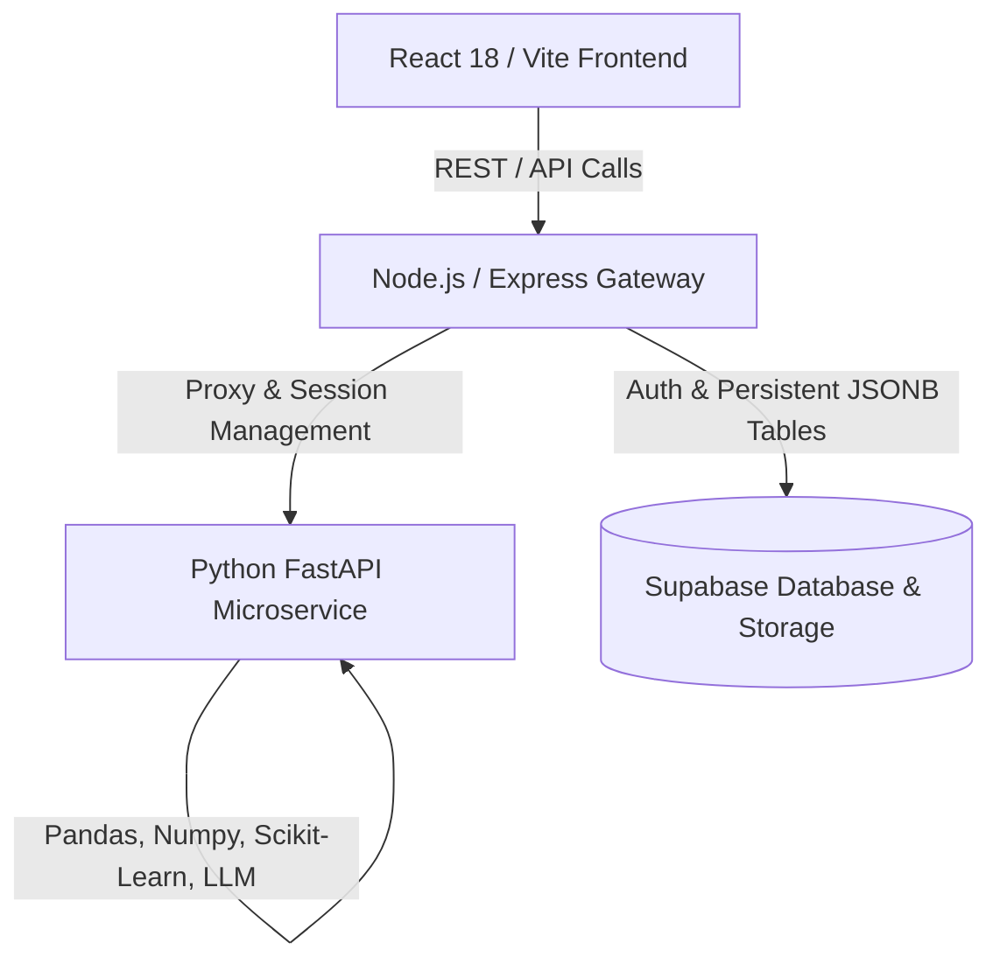

# DataPilot AI 🤖📊

> **DataPilot AI** (internally known as *InsightForge AI*) is an enterprise-grade, high-performance **AI Business Intelligence (BI) and Predictive Analytics Suite**. Designed for executives, data analysts, and managers, it allows users to upload unstructured datasets (CSV, Excel) and instantly generates an interactive, glassmorphic workspace packed with statistical data cleaning, descriptive exploratory data analysis (EDA), machine learning forecasting, ranked risk-ledger classification, and natural language AI query tools.

---

## 🚀 Key Platform Features

*   **🤖 Automated AI Dataset Categorization**: The system dynamically scans incoming CSV/Excel headers, calculates weighted score indexes against domain indicators, categorizes datasets (**Finance**, **HR**, **Retail**, **Healthcare**), alerts users via custom toasts, and automatically pre-selects the domain context.
*   **📈 Predictive Analytics Suite**:
    *   **Time Series Forecasting**: Resamples timeline gaps, computes seasonal cycles (yearly/weekly/monthly) using **Fourier Harmonics**, and projects Ridge/ARIMA/Random Forest models up to 90 steps forward with statistical 95% confidence intervals.
    *   **Churn & Classification Risk Ledgers**: Trains high-precision Random Forest Classifiers on user datasets and generates a ranked cohort list flagging high, medium, and low-priority entity risks.
*   **🧠 Interactive AI Chart Explainer**: Click any bar, slice, or coordinate on interactive charts to open a slide-in glass drawer. It diagnoses spikes and contractions using **Z-Score outliers** ($z > 1.2$) and **linear regression trend lines**, then routes data to LLMs (OpenAI/Groq) for typewriter-animated business briefings.
*   **💻 AI-Generated SQL Query Workspace**: Translates natural language business questions into optimized ANSI SQL queries. Features a custom dark code editor with copy tools, schema sidebar with column datatypes, and dynamic AI query explanations.
*   **🎨 Premium Dashboard Themes**: Switch visual appearances instantly. Variables on the `document.body` level dynamically repaint charts, borders, and gradients to fit:
    *   *Dark Mode (Space Blue)*: Default space slate with violet/indigo accents.
    *   *Finance (Fintech Wealth)*: Emerald green and gold accents on deep vault black.
    *   *Corporate (Executive Trust)*: Royal cobalt and sky blue on corporate navy-slate.
    *   *Startup (Vibrant Growth)*: Synthesizer neon pink and warning orange on dark violet.
*   **🧹 Automated Data Cleaning**: Imputes missing values (median for numeric, mode for categoricals), normalizes datatypes, standardizes date ranges, and produces structured cleaning logs.
*   **📊 Descriptive EDA Engine**: Calculates complete mathematical metrics (min, mean, std, median, skewness badges) and extracts correlation matrices for all numeric variables.
*   **📄 Executive PDF Reporting**: Uses a custom ReportLab compiler to compile forecasts and warning ledgers into beautifully formatted multi-page printable PDFs.

---

## 🗺️ Architectural Flow

DataPilot AI uses a highly responsive, service-oriented architecture:



*   **Vite React Client**: Translucent glassmorphic layouts, animated transitions, interactive gauges, and custom Recharts configurations.
*   **Express API Gateway**: Manages file-upload streams (Multer), coordinates secure session caches, handles gateway proxy routes, and connects to Supabase database tables.
*   **FastAPI Microservice**: Internal mathematical processor performing ML model fittings, statistical EDA calculations, PDF layouts compilation, and LLM text generation.
*   **Supabase PostgreSQL Database**: Stores user details, persistent uploads history, and serializes machine learning predictions into structured JSONB columns.

---

## 🛠️ Technology Stack & Libraries

### Frontend
*   **React 18 & Vite** (Build tool & client)
*   **Recharts** (Custom area, line, bar, pie, and confidence range plots)
*   **Tailwind CSS & CSS Variables** (Dynamic theme mapping & animations)
*   **Lucide React** (Crisp vector icons)
*   **React Hot Toast** (Premium notification alerts)

### Gateway Server
*   **Node.js & Express.js** (API Gateway)
*   **Multer** (Multipart data ingestion)
*   **Axios** (High-speed internal microservice proxying)

### Analytics Microservice
*   **FastAPI & Uvicorn** (Asynchronous Python server)
*   **Pandas & NumPy** (Timeline resamplings, matrix operations, and linear interpolations)
*   **Scikit-Learn** (Ridge Regression, Random Forest Regressor & Classifiers)
*   **ReportLab** (Programmatic corporate PDF page grids layout compiler)

### Third-Party API integrations
*   **Supabase Client** (Cloud PostgreSQL, User Auth & File Bucket storage)
*   **Groq / OpenAI API** (Natural language query structures and diagnostic explanations)

---

## 📂 Project Directory Structure

```text
DataPilot AI/
├── backend/                  # Python FastAPI microservice
│   ├── modules/              # Core analytical modules
│   │   ├── ai_insights.py    # Deep statistics text briefing
│   │   ├── chart_explainer.py# Z-Score peak/contraction diagnostics
│   │   ├── chatbot.py        # Natural language analytics
│   │   ├── data_cleaner.py   # Median/mode missing row imputers
│   │   ├── domain_processor.py# Automate category-scoring engine
│   │   ├── eda_engine.py     # Descriptive statistics & distributions
│   │   ├── pdf_reporter.py   # ReportLab page compiler
│   │   ├── predictive_engine.py# Time series forecasts & Risk Ledgers
│   │   └── sql_generator.py  # NL-to-SQL compiler
│   ├── app.py                # Service routes & FastAPI init
│   └── requirements.txt      # Python dependencies list
│
├── backend-node/             # Node.js Express API Gateway
│   ├── routes/               # Express endpoints proxies
│   ├── services/             # Supabase & python bridge links
│   └── server.js             # Server startup init
│
├── frontend/                 # Vite React client
│   ├── src/
│   │   ├── components/       # Common visual components (Header/Sidebar)
│   │   ├── context/          # State managers (Data, Auth, Themes)
│   │   └── pages/            # Core user panels (Upload, EDA, Predictive)
│   └── package.json          # Node package configurations
│
└── scratch/                  # Verification & Regression suites
    ├── verify_categorization.py# Automated schemas test suite
    └── test_predictive.py    # Analytical models runner
```

---

## ⚡ Getting Started (How to Run)

### 1. Prerequisites
*   Install **Python 3.10+**
*   Install **Node.js 18+**

### 2. Microservice Setup (FastAPI)
```bash
cd backend
python -m venv .venv
source .venv/bin/activate  # On Windows use: .venv\Scripts\activate
pip install -r requirements.txt
python app.py
```
*Microservice starts at `http://localhost:5001/`*

### 3. API Gateway Setup (Express)
```bash
cd backend-node
npm install
npm run dev
```
*Gateway starts at `http://localhost:5000/`*

### 4. Client Workspace Setup (Vite React)
```bash
cd frontend
npm install
npm run dev
```
*Frontend interface starts at `http://localhost:5173/`*

---

## 📄 License & Standard Commits
Created and maintained by Harshini Babu. Stage and commit updates using standard conventions:
```bash
git add .
git commit -m "feat: integrate dynamic visual z-indexing stacking controls in workspace layout"
git push origin main
```